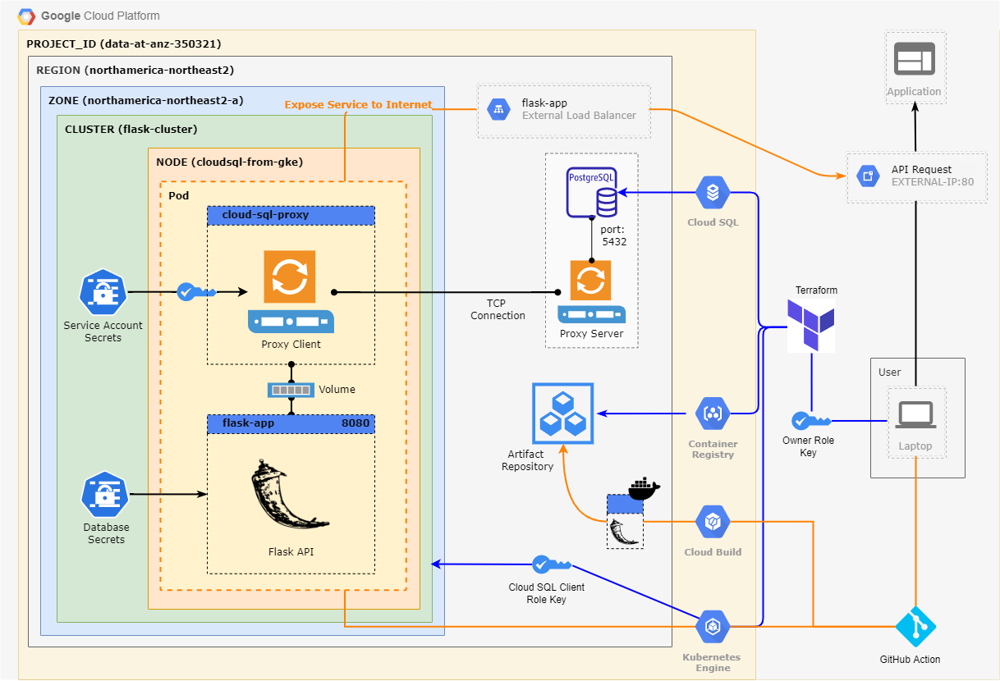

# FlaskAPI on Google Cloud Platform (GCP)
- **Goal**: Deploy a containerized Flask API on Google Cloud Platform, exposing it the internet for API users to make requests and store user information. 


## Application Overview


## Infrastructure Overview



---
## Running the Project
**1. Go to the Goole Cloud console and create a new project.**
- Keep note of the Project ID

**2. Activate Cloud Shell on the top right header and clone this repository in the home directory**
- Copy the following command to clone the repository
```bash
git clone https://github.com/anthonywong611/paas-on-gcp.git
```
- Change directory into the paas-on-gcp folder
```bash
cd paas-on-gcp/
```

**3.**


<!-- ## 1. Create an application repository on GitHub. Document configuration and deployment steps in a README document.
---
## 2. Using the application repository, create a simple container app (using Docker) using Flask or any other simple API framework to expose GET and POST methods.  
- The app should create the table in the database if it does not exist (for all verbs). 
- The POST method is used to insert a new record into the table and the GET method returns records in the table.  
- Use JSON for the request and response formats. 
---
## 3. Create a GitHub action to deploy the application when a PR is merged into the develop branch.
---
### Challenge 1: Deploy the GKE cluster and database instance on a private VPC network, with access via a Global HTTPS load balancer. 
---
### Challenge 2: Implement a basic service mesh using Istio including an egress service entry for Cloud SQL.
--- -->
