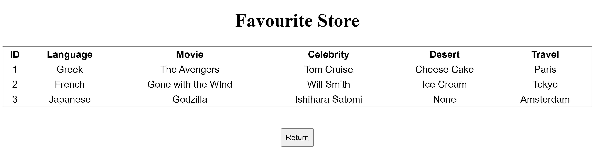

# FlaskAPI on Google Cloud Platform (GCP)

**Goal**: Deploy an app on the cloud environment for API users to make requests and store user information. 

**Rationale**: To achieve the goal efficiently, the following actions are considered
- Write an app using Flask 
- Create a cloud database for the app to connect to and store information in
- Provision a virtual environment to deploy the app in
- Establish a connection between the cloud and the virtual environment so the app may access the database
- Expose the app to the internet

## Technology Overview


**Services & Resources**: 
- Terraform (Manage infrastructures as code)
- CloudSQL (PostgreSQL instance & database)
- Kubernetes Engine (Single-node Kubernetes cluster)
- Google Service Account (CloudSQL Client Role and its key file)
- Cloud Build (Container)
- Artifact Registry (Container repository)

---
# Architecture


## Infrastructure Overview


This project provisions resources through the cloud terminal. Each file in the workflow folder performs a particular task:

**0.var**: Configure all necessary environment variables for the project on the terminal

**1.env**: Setup the project environment and enable relevant services 

**2.cloudsql**: Create a CloudSQL Postgre instance and a database to store data in tables

**3.gke**: Create a Kubernetes cluster to host container(s) 

**4.gke_sql_conn**: Create a service account and generate CloudSQL connection essentials to be stored as secrets in the Kubernetes cluster 

**5.container**: Containerize the app and create a repository to store the container

**6.deployment**: Deploy the container from the repository to the Kubernetes cluster and expose it to the internet

## Application Overview
The Flask application is a simple API exposing the users to GET and POST method. 
- **POST**: Users can input text to submit information to be store in the backend CloudSQL Postgre instance.


- **GET**: Users can click on the "Check" button to view all the previously entered data in a tabular format. Upon request, the application retrieves all data stored in the database and return them as such on the following page



- All the data are stored in the backend database 


---
## Running the Project
**1. Go to the Goole Cloud console**
- Create a new project
- Keep note of the Project ID
- [Determine and keep note of the region and zone](https://cloud.google.com/compute/docs/regions-zones#available)

**2. Activate Cloud Shell**


- Clone this repository in the terminal 

```bash
git clone https://github.com/anthonywong611/paas-on-gcp.git
```

**3. Open the Cloud Shell Editor and set up environment variables**
- Open workflow/[0_var.sh](https://github.com/anthonywong611/paas-on-gcp/blob/main/workflow/0_var.sh)
- Update the project variables with your **Project ID**, **Region**, and **Zone**
- Update the database instance variables to your preference

```bash
# --- Project Info --- #
export PROJECT_ID='<project-id>'  # TODO: Replace these values
export REGION='<region>'  # TODO: Replace these values 
export ZONE='<zone>'  # TODO: Replace these values
export WORKING_DIR=$(pwd)

# --- Database Instance Info --- #
export INSTANCE_HOST='127.0.0.1'
export INSTANCE_NAME='<instance-name>'  # TODO: Replace these values
export DB_USER='<user-name>'  # TODO: Replace these values
export DB_PASS='<password>'  # TODO: Replace these values
export DB_NAME='<database-name>'  # TODO: Replace these values
export DB_PORT='5432'
```

- Open the [deployment.yaml](https://github.com/anthonywong611/paas-on-gcp/blob/main/deployment.yaml) 
- Update, where a "TODO: Replace these values" comment indicates, the lines with the corresponding variables

**4. Open the Terminal and execute the infrastructure workflow**

```bash
cd paas-on-gcp/  # if not in the directory already
```

- The [main.sh](https://github.com/anthonywong611/paas-on-gcp/blob/main/main.sh) file will run all files in the workflow directory

```bash
source main.sh
```

- Wait until all resources have been provisioned

**5. Access the application**
- Once all infrastructures are up and running, run the following command to gain access to get the app service

```bash
kubectl get services  
```

- You may find the status, "pending", under the EXTERNAL-IP column. Wait and keep running the previous command until an IP address shows up.

- Copy the EXTERNAL-IP address of the service flask-app and access it from another tab


- You should see the following web page show up


- Click on the "Start" button and you will be directed to the application as shown in the **Application Overview** section above

**6. Clean up the project**
- Run the following command to terminate all infrastructures and accounts

```bash
source clean_up.sh
```


<!-- ## 1. Create an application repository on GitHub. Document configuration and deployment steps in a README document.
---
## 2. Using the application repository, create a simple container app (using Docker) using Flask or any other simple API framework to expose GET and POST methods.  
- The app should create the table in the database if it does not exist (for all verbs). 
- The POST method is used to insert a new record into the table and the GET method returns records in the table.  
- Use JSON for the request and response formats. 
---
## 3. Create a GitHub action to deploy the application when a PR is merged into the develop branch.
---
### Challenge 1: Deploy the GKE cluster and database instance on a private VPC network, with access via a Global HTTPS load balancer. 
---
### Challenge 2: Implement a basic service mesh using Istio including an egress service entry for Cloud SQL.
--- -->
