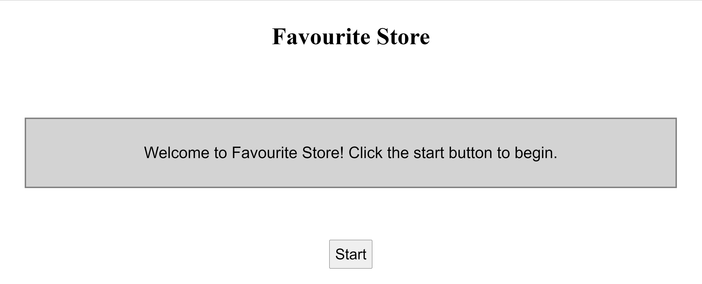

# Project Description

**Goal: Run an app on the cloud for API users to make requests and store user information.** 

## Rationale 
To achieve the goal efficiently, this project proceeds with the following path

**Application**: Write an app with features in user authentication and form submission

**Connection**: Create a cloud database for storing app information. We need to ensure a secured connection between the app and the database

**Deployment**: Deploy the app and expose it to the internet

## Technology Overview


### Flask
The application is a simple API written using the Flask framework. Flask offers extensions like database access, template engine, user authentication, etc. 

### Terraform
Terraform is an Infrastructure-as-Code (IaC) service that allows users to provision cloud infrastructures with reusable codes. It uses configuration language to provision cloud infrastrucutres, and can simultaneously plan and manage resources from different cloud providers like AWS, GCP, and Azure. Using Terraform can significantly improve efficiency and reduce time in provisioning resources, circumventing issues like manually updating configurations on the console or on the command-line.

### Google Cloud Platform (GCP)
**CloudSQL**: We will create a PostgreSQL database instance with a user-defined root user, password, and database. This will be the database for storing user info.

**Kubernetes Engine**: Kubernetes creates clusters with nodes. Each node in a cluster has pods that can be aggregated as a service to be exposed to the internet. We will spin up a Kubernetes cluster with a single master-node which will run the pod where our application will be located. 

- Kubernetes can store sensitive information like password and credentials as secrets. We will store database username and password in the pod as secrets.

**Artifact Registry**: This is a container registry for storing container images. Kubernetes looks for images from the repository and run them on pods.

**Cloud Build**: This is Google's equivalent of docker, and we will build the application as a container image here and push it to the registry.

**Google Service Account (GSA)**: Cloud resources require permission to interact with other resources. In particular, we need to generate credential keys from service accounts with the following priviledges:

- Owner Role (for machines or softwares to provision and interact with infrastructures on behalf of GCP)
- CloudSQL Client Role (for Kubernetes to establish a TCP connection between the SQL database and the application inside the cluster)

---
# Architecture (Infrastructures & Application)


## Infrastructure Overview


This project provisions resources through the cloud terminal. Each file in the workflow folder performs a particular task:

**0.var**: Configure all necessary environment variables for the project on the terminal

**1.env**: Setup the project environment and enable relevant services 

**2.cloudsql**: Create a CloudSQL Postgre instance and a database to store data in tables

**3.gke**: Create a Kubernetes cluster to host container(s) 

**4.gke_sql_conn**: Create a service account and generate CloudSQL connection essentials to be stored as secrets in the Kubernetes cluster 

**5.container**: Containerize the app and create a repository to store the container

**6.deployment**: Deploy the container from the repository to the Kubernetes cluster and expose it to the internet

## Application Overview
The Flask application is a simple API exposing the users to GET and POST method. 
- **POST**: Users can input text to submit information to be store in the backend CloudSQL Postgre instance.


- **GET**: Users can click on the "Check" button to view all the previously entered data in a tabular format. Upon request, the application retrieves all data stored in the database and return them as such on the following page


- All the data are stored in the backend database 


---
## Running the Project
**1. Go to the Goole Cloud console**
- Create a new project
- Keep note of the Project ID
- [Determine and keep note of the region and zone](https://cloud.google.com/compute/docs/regions-zones#available)

**2. Activate Cloud Shell**


- Clone this repository in the terminal 

```bash
git clone https://github.com/anthonywong611/paas-on-gcp.git
```

**3. Open the Cloud Shell Editor and set up environment variables**
- Open workflow/[0_var.sh](https://github.com/anthonywong611/paas-on-gcp/blob/main/workflow/0_var.sh)
- Update the project variables with your **Project ID**, **Region**, and **Zone**
- Update the database instance variables to your preference

```bash
# --- Project Info --- #
export PROJECT_ID='<project-id>'  # TODO: Replace these values
export REGION='<region>'  # TODO: Replace these values 
export ZONE='<zone>'  # TODO: Replace these values
export WORKING_DIR=$(pwd)

# --- Database Instance Info --- #
export INSTANCE_HOST='127.0.0.1'
export INSTANCE_NAME='<instance-name>'  # TODO: Replace these values
export DB_USER='<user-name>'  # TODO: Replace these values
export DB_PASS='<password>'  # TODO: Replace these values
export DB_NAME='<database-name>'  # TODO: Replace these values
export DB_PORT='5432'
```

- Open the [deployment.yaml](https://github.com/anthonywong611/paas-on-gcp/blob/main/deployment.yaml) 
- Update, where a "TODO: Replace these values" comment indicates, the lines with the corresponding variables

**4. Open the Terminal and execute the infrastructure workflow**

```bash
cd paas-on-gcp/  # if not in the directory already
```

- The [main.sh](https://github.com/anthonywong611/paas-on-gcp/blob/main/main.sh) file will run all files in the workflow directory

```bash
source main.sh
```

- Wait until all resources have been provisioned

**5. Access the application**
- Once all infrastructures are up and running, run the following command to gain access to get the app service

```bash
kubectl get services  
```

- You may find the status, "pending", under the EXTERNAL-IP column. Wait and keep running the previous command until an IP address shows up.

- Copy the EXTERNAL-IP address of the service flask-app and access it from another tab


- You should see the following web page show up



- Click on the "Start" button and you will be directed to the application as shown in the **Application Overview** section above

**6. Clean up the project**
- Run the following command to terminate all infrastructures and accounts

```bash
source clean_up.sh
```


<!-- ## 1. Create an application repository on GitHub. Document configuration and deployment steps in a README document.
---
## 2. Using the application repository, create a simple container app (using Docker) using Flask or any other simple API framework to expose GET and POST methods.  
- The app should create the table in the database if it does not exist (for all verbs). 
- The POST method is used to insert a new record into the table and the GET method returns records in the table.  
- Use JSON for the request and response formats. 
---
## 3. Create a GitHub action to deploy the application when a PR is merged into the develop branch.
---
### Challenge 1: Deploy the GKE cluster and database instance on a private VPC network, with access via a Global HTTPS load balancer. 
---
### Challenge 2: Implement a basic service mesh using Istio including an egress service entry for Cloud SQL.
--- -->
