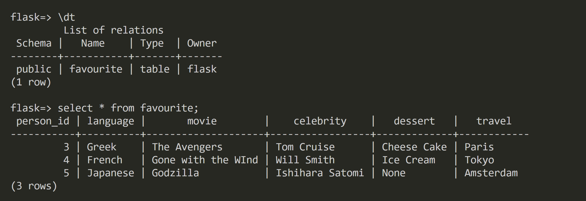
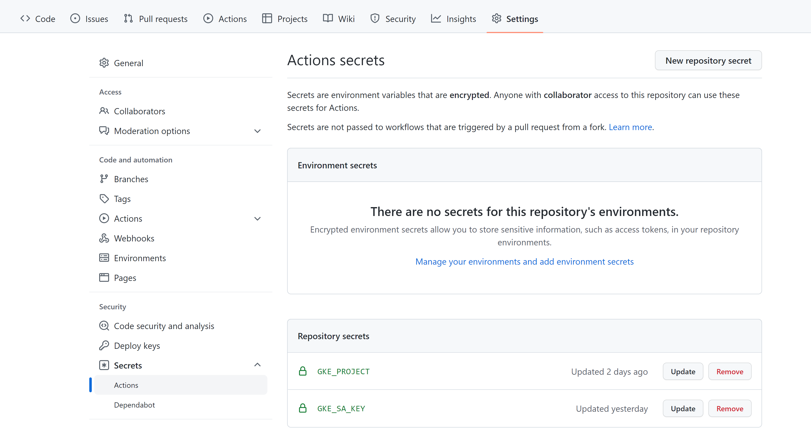

# Project Description

**Goal: Run an app on the cloud for API users to make requests and store user information.** 

## Rationale 
To achieve the goal efficiently, this project proceeds with the following path

**Application**: Write an app with features in user authentication and form submission

**Connection**: Create a cloud database for storing app information. We need to ensure a secured connection between the app and the database

**Deployment**: Deploy the app and expose it to the internet

## Technology Overview


### Flask
The application is a simple API written using the Flask framework. Flask offers extensions like database access, template engine, user authentication, etc. 

### Terraform
Terraform is an Infrastructure-as-Code (IaC) service that allows users to provision cloud infrastructures with reusable codes. It uses configuration language to provision cloud infrastrucutres, and can simultaneously plan and manage resources from different cloud providers like AWS, GCP, and Azure. Using Terraform can significantly improve efficiency and reduce time in provisioning resources, circumventing issues like manually updating configurations on the console or on the command-line.

### Google Cloud Platform (GCP)
**CloudSQL**: We will create a PostgreSQL database instance with a user-defined root user, password, and database. This will be the database for storing user info.

**Kubernetes Engine**: Kubernetes creates clusters with nodes. Each node in a cluster has pods that can be aggregated as a service to be exposed to the internet. We will spin up a Kubernetes cluster with a single master-node which will run the pod where our application will be located. 

- Kubernetes can store sensitive information like password and credentials as secrets. We will store database username and password in the pod as secrets.

**Artifact Registry**: This is a container registry for storing container images. Kubernetes looks for images from the repository and run them on pods.

**Cloud Build**: This is Google's equivalent of docker, and we will build the application as a container image here and push it to the registry.

**Google Service Account (GSA)**: Cloud resources require permission to interact with other resources. In particular, we need to generate credential keys from service accounts with the following priviledges:

- Owner Role (for machines or softwares to provision and interact with infrastructures on behalf of GCP)
- CloudSQL Client Role (for Kubernetes to establish a TCP connection between the SQL database and the application inside the cluster)

---
# Architecture (Infrastructures & Application)


## Infrastructure Overview


Terraform plans and provisions infrastructures using the [main.tf](terraform/main.tf) file in the terraform folder with [variables.tf](terraform/variables.tf) as input file. The [terraform.tfvars](terraform/terraform.tfvars) file specifies any variables from [variables.tf](terraform/variables.tf) that don't have a default parameters. 

The artifact_registry, cloudsql, and gke folders are sub-modules implemented in a similar fashion. 

We only create the CloudSQL database instance, the Kubernetes cluster, and the container repository here. The actual containerization process using docker (Cloud Build) will take place using GitHub actions. 

The GitHub action configuration can be found in the [cloudbuilds_gke.yaml](.github/workflows/cloudbuilds_gke.yaml) file.

## Application Overview
The Flask application is a simple API exposing the users to GET and POST method. 
- **POST**: Users can input text to submit information to be store in the backend CloudSQL Postgre instance.


- **GET**: Users can click on the "Check" button to view all the previously entered data in a tabular format. Upon request, the application retrieves all data stored in the database and return them as such on the following page


- All the data are stored in the backend database 



---

# Running the Project

## 0. Preparation

- Create a new project
- Keep note of the Project ID
- [Determine and keep note of the region and zone](https://cloud.google.com/compute/docs/regions-zones#available)
- Enable API for CloudSQL, Kubernetes Engine, Cloud Build, and Artifact Registry

## 1. Create Service Accounts and Download Credentials

- Go to IAM and create a service account called **owner-sa** with Owner role
- Download a new key in JSON format and rename it **owner-sa-key.json**
- Create another service account called **cloudsql-sa** with Cloud SQL Client role
- Download a new key in JSON format and rename it **cloudsql-sa-key.json**


## 2. Project Environment Setup

- Fork and clone this repository in a local terminal 
- Create a folder called **service_accounts** in the **terraform** folder
- Move both **owner-sa-key.json** and **cloudsql-sa-key.json** files to the **service_accounts** folder
- Set environment variable for grant terraform permission to provision GCP resources

```bash
export GOOGLE_APPLICATION_CREDENTIALS="<path_to>/FlaskAPI-GCP-Applications/terraform/service_accounts/owner-sa-key.json"
```

## 3. Update Configurations
- Update the variables in [terraform.tfvars](terraform/terraform.tfvars) where a **TODO** comment indicates
- Update the variables in [cloudbuilds_gke.yaml](.github/workflows/cloudbuilds_gke.yaml) where a **TODO** comment indicates

## 3. GitHub Actions Setup

- Go to the forked repository settings and select action secrets
- Create a secret called **GKE_PROJECT** and put in your Project ID as value
- Create a secret called **GKE_SA_KEY** and paste the content of the **owner-sa-key.json** in as value



## 4. Install Requirements and Initialize 

- Install [gcloud](https://cloud.google.com/sdk/docs/install) 

- Install [kubectl](https://cloud.google.com/kubernetes-engine/docs/how-to/cluster-access-for-kubectl)

- Install [terraform](https://www.terraform.io/downloads) 

## 5. Provision the Infrastructures

```bash
gcloud init  # Set up your project ID, region, and zone

terraform init  # Make sure you are in the terraform/ folder

terraform workspace new dev  # The default workspace is 'default'. We will work in the 'dev' workspace

terraform plan  # Let you preview the infrastructure changes

terraform apply --auto-approve  
```

- Once it finishes building, the terminal will output a list of infrastructure info

```bash
terraform output  # If no outputs printed
```

## 6. Update Kubernetes Configurations

- Take note of the CloudSQL instance name outputed by terraform
- Update the lines in the [deployment.yaml](deployment.yaml) file where a **TODO** comment indicates
- Store database username, password, and CloudSQL Client Role credential key as Kubernetes secrets

```bash
gcloud container clusters get-credentials flask-cluster  # Get credentials for kubectl to work with the cluster
```

```bash
kubectl create secret generic postgres-secret \
--from-literal=username=<sql_user> \  
--from-literal=password=<sql_pass> \
--from-literal=database=<db_name> 
```

```bash
kubectl create secret generic cloudsql-sa \
--from-file=service_account.json=service_accounts/cloudsql-sa-key.json
```


## 7. Deploy the Application Using GitHub Actions

- Commit and push the changes previously made to the configurations 
- The GitHub Action will be triggered when the changes are pushed. It will automatically containerize the application using Cloud Build and store it in the repository, then it will deploy the container image to Kubernetes and expose it to the internet through a service.

## 8. Access the Application

```bash
kubectl get services  # You may find the status, "pending", under the EXTERNAL-IP column. Wait and keep running the previous command until an IP address shows up.
```

- Copy the EXTERNAL-IP address of the service flask-app and access it from another tab


- You should see the following web page show up


- Click on the "Start" button and you will be directed to the application as shown in the **Application Overview** section above

## 9. Clean up the project

```bash
terraform destroy --auto-approve
```

- Delete the **owner-sa** and **cloudsql-sa** service accounts (Optional)
- Delete the credential keys and GiHub action secrets (Optional)
